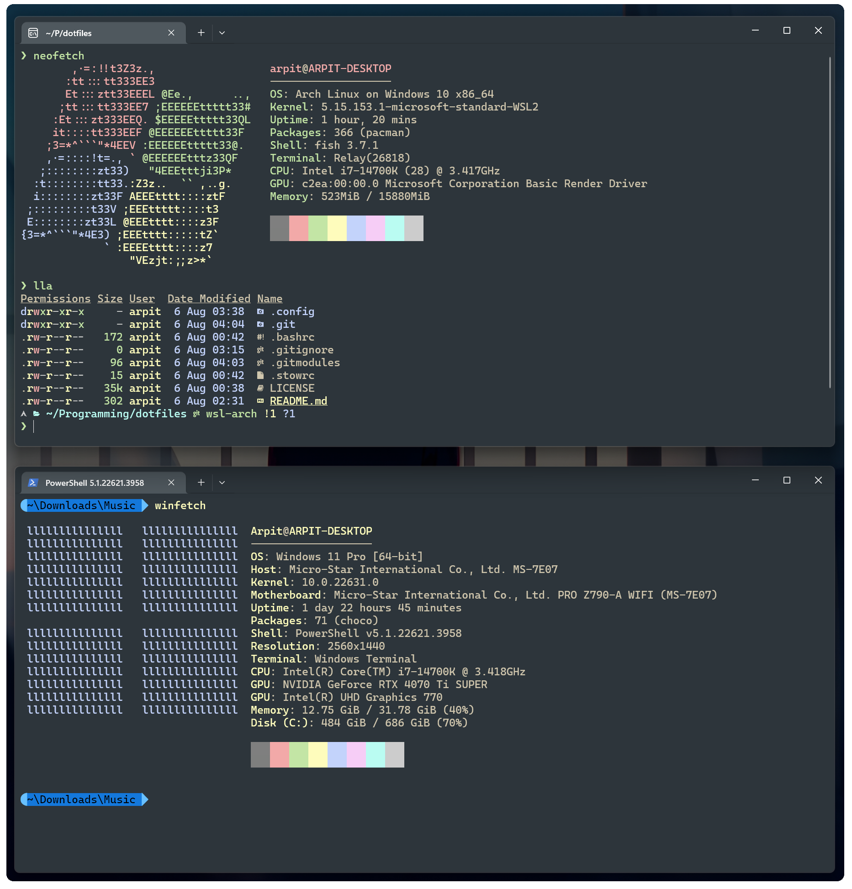

<h3 align="center">
	<br/>
	
	Everforest for <a href="https://github.com/Microsoft/Terminal">Windows Terminal</a>
	
</h3>

<p align="center">
  
</p>

Slightly customized everforest color scheme for the windows terminal

## Usage

Append the scheme defined under `schemes` list in `schemes.json` to the `settings.json` file of windows terminal which could be opened using:

```
Settings -> Open JSON file
```
